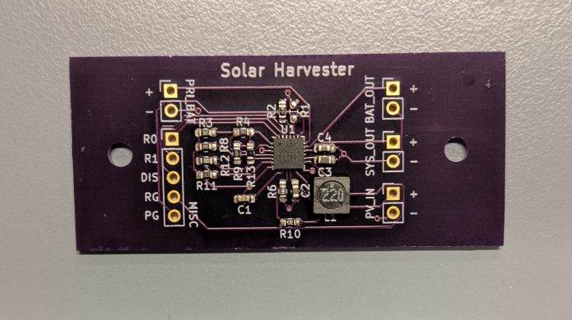

# Solar Harvester

Analog Devices' **ADP5092**-based solar harvester designed for **Voltaic's P121 solar panel** and **3.7 V rechargeable battery**.
It contains proper low and high-voltage cutouts to protect the battery.
If you are planning to use other than a 3.7 V battery or the preferred panel, update the resistor values for proper cutout levels (please refer to the datasheet of the IC).

The design has been tested and proven with field deployments.

